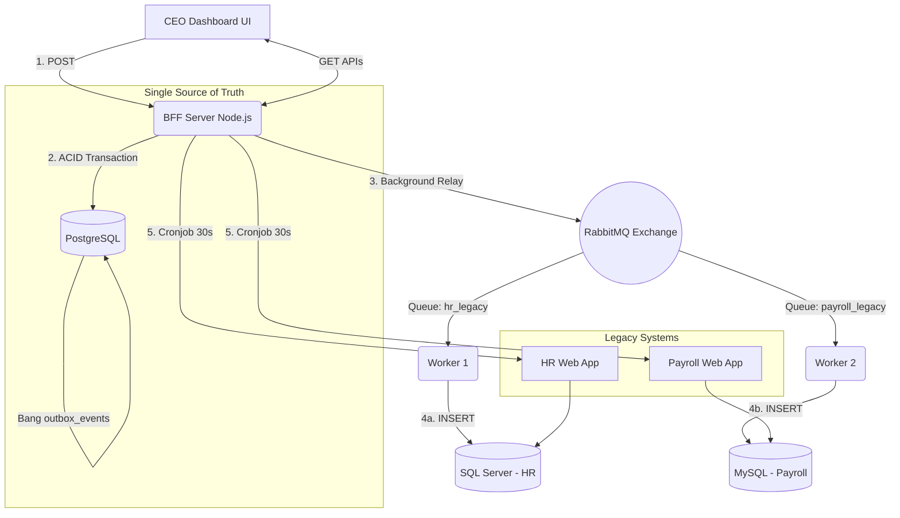

# 📊 Executive Unified Dashboard - Tích Hợp Hệ Thống (Case Study 3)


---

## 📑 Mục lục
1. [Tổng quan dự án](#-tổng-quan-dự-án)
2. [Kiến trúc hệ thống](#-kiến-trúc-hệ-thống)
3. [Tech Stack](#-tech-stack)
4. [Yêu cầu hệ thống](#-yêu-cầu-hệ-thống-prerequisites)
5. [Hướng dẫn cài đặt & Khởi chạy](#-hướng-dẫn-cài-đặt--khởi-chạy)
6. [Database Schema](#-database-schema)
7. [Tài liệu API](#-tài-liệu-api)
8. [Tính năng hệ thống](#-tính-năng-hệ-thống)
9. [Luồng hoạt động (Workflows)](#-luồng-hoạt-động-workflows)
10. [Tính toàn vẹn dữ liệu (ACID)](#-tính-toàn-vẹn-dữ-liệu--acid)
11. [Xử lý lỗi phổ biến (Troubleshooting)](#-xử-lý-lỗi-phổ-biến-troubleshooting)

---

## 🎯 Tổng quan dự án

Dự án **Executive Unified Dashboard** là giải pháp Tích hợp Hệ thống (System Integration) nhằm giải quyết bài toán phân mảnh dữ liệu giữa các hệ thống Legacy (HR và Payroll). 

> **CEO Memo Core Requirement:** *"Single Data Entry, distributed to other databases in near real-time."*

Hệ thống cung cấp một Dashboard duy nhất cho ban lãnh đạo (CEO) quản lý tổng thể. Khi có nhân sự mới, dữ liệu chỉ cần nhập **MỘT LẦN** tại Dashboard trung tâm, sau đó sẽ được tự động phân phối (Near Real-time) xuống 2 cơ sở dữ liệu cũ (SQL Server và MySQL) mà không làm gián đoạn hệ thống. Đồng thời, hệ thống liên tục cào (scrape) dữ liệu từ các web app cũ để đồng bộ ngược lại tạo thành một bức tranh toàn cảnh (Single Source of Truth).

---

## 🏗 Kiến trúc hệ thống


---

## 💻 Tech Stack

| Công nghệ | Thành phần | Mục đích / Chức năng |
| :--- | :--- | :--- |
| **Node.js + Express** | BFF Server | API Gateway, xử lý logic nội suy, Cronjob scraping, phục vụ file tĩnh. |
| **PostgreSQL** | Central DB | Lưu trữ trung tâm (Single Source of Truth), quản lý Outbox pattern. |
| **RabbitMQ** | Message Broker | Đảm bảo giao nhận tin nhắn bất đồng bộ, chống mất mát dữ liệu. |
| **SQL Server** | Legacy HR DB | Nơi lưu trữ dữ liệu nhân sự cũ. |
| **MySQL** | Legacy Payroll DB | Nơi lưu trữ dữ liệu lương cũ. |
| **Cheerio** | Web Scraper | Cào (Parse HTML) từ 2 hệ thống Legacy cũ. |
| **Vanilla JS/HTML/CSS**| Frontend | Giao diện không framework, hiệu năng cao, render biểu đồ. |

---

## ⚙️ Yêu cầu hệ thống (Prerequisites)

Để chạy dự án, máy tính cần cài đặt:
- **Node.js** (v16+ khuyến nghị)
- **PostgreSQL** (v13+)
- **Microsoft SQL Server** & **SSMS** (SQL Server Management Studio)
- **MySQL** (XAMPP hoặc MySQL Workbench)
- **RabbitMQ** (Cài đặt qua Docker hoặc file cài .exe trên Windows)

---

## 🚀 Hướng dẫn cài đặt & Khởi chạy

### Bước 1: Cấu hình SQL Server (HR Legacy)
1. Mở SSMS, chuột phải vào Server Node -> `Properties` -> `Security` -> Chọn **SQL Server and Windows Authentication mode** (Bật Mixed Mode).
2. Vào `Security` -> `Logins` -> Chuột phải tài khoản `sa` -> `Properties`:
   - Đặt password là: `a123456*`
   - Tab `Status`: Chọn **Enabled**.
3. Mở **SQL Server Configuration Manager**:
   - `SQL Server Network Configuration` -> `Protocols` -> Enable **TCP/IP**.
   - Chuột phải TCP/IP -> `Properties` -> `IP Addresses` -> Cuộn xuống `IPAll` -> Xóa TCP Dynamic Ports để trống toàn bộ kể, đặt `TCP Port` là **1433**.
4. **Restart** SQL Server Service.
5. Tạo database `HR` và import file script (nếu có).

### Bước 2: Cấu hình MySQL (Payroll Legacy)
1. Mở MySQL (port mặc định 3306).
2. Tạo database `payroll`.
3. Đảm bảo user là `root` và password để trống.

### Bước 3: Cấu hình PostgreSQL (Central DB)
1. Mở pgAdmin hoặc psql (port mặc định 5432).
2. Tạo database:
```
-- 1. Tạo Database mới cho hệ thống tích hợp
CREATE DATABASE acme_corp_db;

-- LƯU Ý QUAN TRỌNG: Bạn phải chuyển kết nối vào database "acme_corp_db" vừa tạo 
-- trước khi bôi đen và chạy các lệnh CREATE TABLE dưới đây!

-- 2. Bảng lưu trữ dữ liệu gốc của nhân viên (Single Source of Truth)
CREATE TABLE employees (
    id SERIAL PRIMARY KEY,
    first_name VARCHAR(255) NOT NULL,
    last_name VARCHAR(255) NOT NULL,
    ssn VARCHAR(50) NOT NULL,
    gender VARCHAR(50),
    ethnicity VARCHAR(100),
    department VARCHAR(100),
    emp_type VARCHAR(50),
    shareholder VARCHAR(10),
    benefit_plan VARCHAR(100),
    salary_ytd NUMERIC,
    vacation_days INTEGER,
    created_at TIMESTAMP DEFAULT CURRENT_TIMESTAMP
);
-- 3. Bảng quan trọng nhất: Hàng đợi sự kiện (Transactional Outbox Pattern)
CREATE TABLE outbox_events (
    id SERIAL PRIMARY KEY,
    aggregate_type VARCHAR(50) NOT NULL,
    payload JSONB NOT NULL,
    status VARCHAR(20) DEFAULT 'PENDING',
    created_at TIMESTAMP DEFAULT CURRENT_TIMESTAMP
);
```

3. Đảm bảo user là `postgres` và password là `123456`.
4. (*Quan trọng*) Chạy lệnh sau để tránh lỗi trùng ID:
   ```sql
   ALTER SEQUENCE employees_id_seq RESTART WITH 2500000;
   ```

### Bước 4: Cài đặt thư viện Node.js
Mở terminal tại thư mục dự án và chạy:
```bash
npm install express cors cheerio pg amqplib mssql mysql2 readline
```

### Bước 5: Khởi động hệ thống (Mở 3 Terminal)
Thực hiện chạy theo đúng thứ tự sau:

**Terminal 1 (Khởi động hệ thống Legacy):**
```bash
# Đảm bảo 2 app Legacy đang chạy ở port 19335 (HR) và 8080 (Payroll)
```

**Terminal 2 (Chạy Worker Consumer):**
```bash
node worker-legacy.js
```

**Terminal 3 (Chạy BFF Server & UI):**
```bash
node bff-server.js
```
*Truy cập UI tại:* `http://localhost:3000`

### Bước 6: Cài đặt và chạy RabbitMQ (Bắt buộc)
Hệ thống yêu cầu RabbitMQ để xử lý Message Queue. Cách nhanh nhất và sạch nhất là chạy qua Docker.

**1. Cài đặt Docker Desktop:**
- Tải và cài đặt Docker Desktop từ: [https://www.docker.com/products/docker-desktop/](https://www.docker.com/products/docker-desktop/)
- Khởi động Docker Desktop và đảm bảo icon ở khay hệ thống hiển thị màu xanh (Engine running).

**2. Chạy RabbitMQ Container:**
-Mở một Terminal mới (hoặc Command Prompt) và chạy lệnh sau để tải image và khởi động RabbitMQ kèm giao diện quản lý (Management Plugin):
```bash
docker run -d --name rabbitmq-server -p 5672:5672 -p 15672:15672 rabbitmq:3-management
```
-Đăng nhập xem giao diện quản trị:

Truy cập trình duyệt: http://localhost:15672

Username: guest

Password: guest

Tại đây bạn có thể xem các Queue (hr_legacy_queue, payroll_legacy_queue) hoạt động realtime.
-Cho những lần chạy dự án sau này:
Bạn KHÔNG cần chạy lại lệnh docker run dài dòng phía trên nữa (nếu chạy sẽ bị lỗi trùng tên). Thay vào đó, chỉ cần đảm bảo đã khởi động docker, cmd gõ lệnh sau để
bật lại container:

Bash:
docker start rabbitmq-server
---

## 🔌 Tài liệu API (BFF Server)

| HTTP Method | Endpoint | Chức năng | Body / Params |
| :--- | :--- | :--- | :--- |
| `POST` | `/api/employees` | Tạo nhân viên mới + Lưu Outbox | JSON payload (14 fields) |
| `GET` | `/api/employees/:mode` | Lấy dữ liệu phân trang | `mode`: `unified` / `hr` / `payroll` |
| `GET` | `/api/dashboard/stats` | Lấy KPI tổng hợp | Không có |
| `GET` | `/api/dashboard/charts` | Lấy data vẽ biểu đồ | Không có |
| `GET` | `/api/sync` | Cào dữ liệu thủ công | Không có |

---

## ✨ Tính năng hệ thống


**DASHBOARD (Unified Tab):**
- **KPI Cards:** Tổng Headcount tự động xử lý Deduplication *(HR + Payroll - Trùng lặp)*.
- **Alert Cards (Drill-down):** 4 thẻ cảnh báo màu sắc - Click để lọc trực tiếp vào bảng.
- **Biểu đồ động (Charts):** Phân tích Lương, Phép năm, Quyền lợi.
- **Smart Table:** 8 cột với Alert Tags trực quan (Sinh nhật, Kỷ niệm, Đổi Plan).
- **Fuzzy Search & Phân trang:** Tìm kiếm linh hoạt, Server-side pagination, Auto-refresh không làm gián đoạn UI.

---

## 🔄 Luồng hoạt động (Workflows)

### 1. Luồng thêm nhân viên mới (Write Path)
1. User điền Form 14 trường trên UI và submit.
2. BFF Server mở `ACID Transaction` trong PostgreSQL.
3. Insert vào bảng `employees` và `outbox_events` (`status: PENDING`), sau đó `COMMIT`.
4. Cronjob (3s) quét bảng outbox, lấy dòng `PENDING` đẩy lên RabbitMQ, update thành `PROCESSED`.
5. Worker nhận Message và Insert song song vào SQL Server và MySQL.

### 2. Luồng cào dữ liệu tự động (Scraping/Read Path)
1. BFF chạy `syncFromLegacy()` mỗi 30 giây.
2. Đọc trang 1, dùng Regex lấy "Tổng số trang".
3. Dùng `Promise.all` chạy thuật toán **Head & Tail Scraping**.
4. Chạy thuật toán **Deduplication** gộp các bản ghi trùng lặp.
5. Ghi stream xuống file `.jsonl` để tránh tràn RAM.

---

## 🛡️ Tính toàn vẹn dữ liệu (ACID & Patterns)

Dự án áp dụng **Transactional Outbox Pattern** để giải bài toán Dual-Write. Bằng cách sử dụng Transaction của PostgreSQL để insert Data và Outbox message trong **cùng 1 commit**, hệ thống đảm bảo nếu RabbitMQ rớt mạng, dữ liệu vẫn an toàn ở trạng thái `PENDING`. Khi mạng phục hồi, Relay tự động đẩy tiếp, đảm bảo **Eventual Consistency** (Nhất quán cuối).

---

## 🛠️ Xử lý lỗi phổ biến (Troubleshooting)

| # | Hiện tượng lỗi (Error) | Nguyên nhân | Cách khắc phục |
| :--- | :--- | :--- | :--- |
| 1 | **Login failed for user 'sa'** | Chưa bật Mixed Mode Authentication. | Mở SSMS > Security > Chọn SQL Server and Windows mode. |
| 2 | **Violation of PRIMARY KEY** | ID mới trùng với ID cũ trong Legacy. | Chạy `ALTER SEQUENCE employees_id_seq RESTART WITH 3000000;` trong Postgres. |
| 3 | **Foreign Key Constraint** | Hardcode ID = 1 khi insert. | Đổi code thành query động `SELECT TOP 1...` để lấy ID thực tế. |
| 4 | **Unknown column PayRates_id** | Sai tên cột trong câu Insert. | Sửa tên cột lại thành `PayRates_id` trong code worker. |
| 5 | **Out of range value** | Cột decimal(2,0) max là 99. | Thêm logic `Math.min(salary, 99)` vào code trước khi Insert. |
| 6 | **UI Reload liên tục** | Dùng Live Server. | Tắt Live Server, truy cập `http://localhost:3000`. |
| 7 | **Ô input số trang bị reset** | Auto-refresh 10s cập nhật DOM. | Update code JS: `if (document.activeElement !== pageInput)` |
| 8 | **RabbitMQ Connection Refused** | Service RabbitMQ chưa chạy. | Khởi động lại container Docker hoặc service RabbitMQ trên Windows. |

---


---
